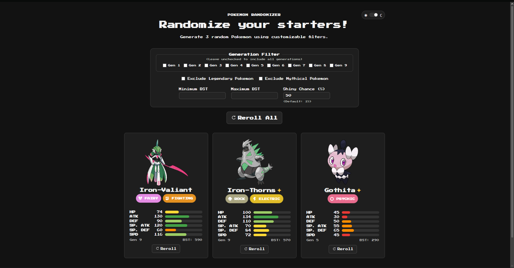
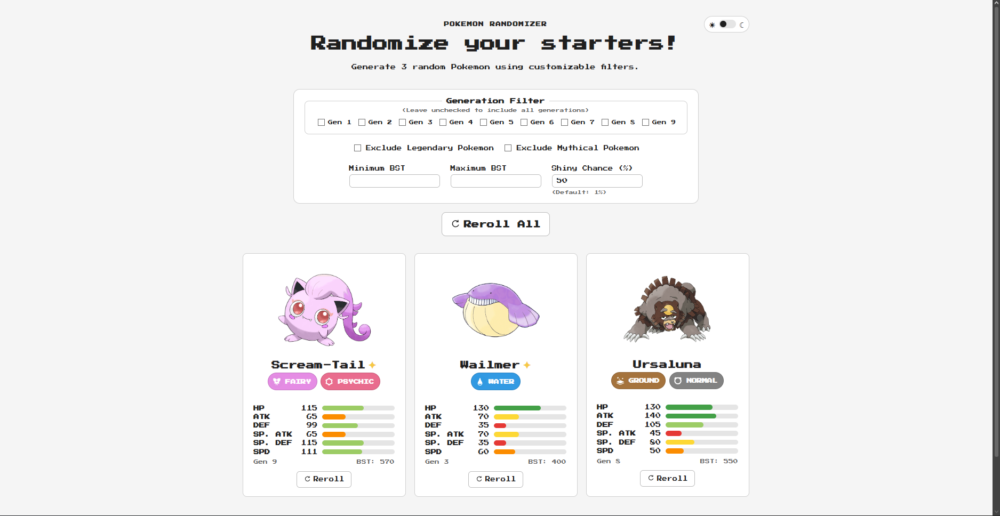

# Pokemon Randomizer

A full-stack web application for generating randomized Pokemon starters using customizable filters and reroll rules.

The project was built as a fan tool for Pokemon challenge-style content and as a way to practice full-stack software development with React, TypeScript, FastAPI, and Python.

## Features

- Generate 3 unique random Pokemon
- Filter by one or more generations
- Exclude Legendary Pokemon
- Exclude Mythical Pokemon
- Filter by minimum and maximum base stat total (BST)
- Configure shiny chance from 0% to 100%
- Display shiny artwork and a shiny indicator
- Reroll individual Pokemon without duplicating currently visible Pokemon
- Reroll the full set
- Display:
  - Official artwork
  - Pokemon types and type icons
  - All six base stats
  - Visual stat-strength bars
  - Generation
  - BST
- Light and dark themes with saved theme preference
- Responsive layout for desktop and mobile screens

## Screenshots

### Dark Mode



### Light Mode



## Tech Stack

### Frontend

- React
- TypeScript
- Vite
- CSS

### Backend

- Python
- FastAPI
- Pydantic

### Testing

- pytest
- FastAPI TestClient
- pytest-cov
- ESLint
- TypeScript/Vite production builds

## Architecture

The application separates presentation, API, and randomization responsibilities:

Frontend (React + TypeScript)
    ↓
FastAPI routes
    ↓
Randomizer service
    ↓
Local Pokemon dataset

Pokemon generation and filtering are handled by the backend so the randomization rules remain consistent regardless of the frontend.

The application uses a local JSON dataset during normal runtime rather than depending on an external API.

## Pokemon Data

The runtime dataset contains 1,025 Pokemon species using their default PokeAPI varieties.

The dataset includes:

- National Pokedex number
- English display name
- Generation
- Type(s)
- Six base stats
- Legendary status
- Mythical status

A Python import tool retrieves and transforms data from PokeAPI into the application's internal `Pokemon` model.

New imports are written to `pokemon_preview.json` first so the generated data can be reviewed before replacing the runtime `pokemon.json` dataset.

## Running Locally

### Backend

From the `backend` directory, create a virtual environment:

```powershell
python -m venv .venv
```

Activate the virtual environment, then install the backend dependencies:

```powershell
pip install -r requirements.txt
```

Start the FastAPI development server:

```powershell
python -m uvicorn app.main:app --reload
```

The backend will run locally at:

```text
http://127.0.0.1:8000
```

FastAPI's interactive API documentation is available at:

```text
http://127.0.0.1:8000/docs
```

### Frontend

From the `frontend` directory, install the frontend dependencies:

```powershell
npm install
```

Start the Vite development server:

```powershell
npm run dev
```

The frontend will normally run at:

```text
http://localhost:5173
```

The frontend supports the `VITE_API_BASE_URL` environment variable for configuring the backend API address. If it is not provided, the application falls back to the local FastAPI server during development.

## Testing

The backend includes automated tests covering:

- Random Pokemon generation
- Unique results
- Generation filtering
- Legendary and Mythical exclusion
- BST filtering
- Invalid filter combinations
- Shiny generation
- Pokemon exclusions used by rerolling
- API request and response behavior
- Pokemon data importing and validation

Run the backend test suite from the project root with the backend virtual environment active:

```powershell
python -m pytest
```

The current v1 backend test suite contains **37 passing tests**.

Frontend linting can be run from the `frontend` directory with:

```powershell
npm run lint
```

To verify that the frontend can produce a production build:

```powershell
npm run build
```

## Future Ideas

Possible post-v1 additions include:

- Ultra Beast filtering
- Pokemon forms and alternate varieties
- Type-based filtering
- Seeded and reproducible randomization
- Duplicate-free generation sessions
- Configurable Pokemon count
- Additional creator-focused randomizer tools

## Live Demo

https://pokemon-randomizer-4i7w.onrender.com

## Disclaimer

This is an unofficial fan project.

This project is not affiliated with or endorsed by Nintendo, Game Freak, Creatures Inc., or The Pokemon Company.

Pokemon-related trademarks and intellectual property belong to their respective owners.